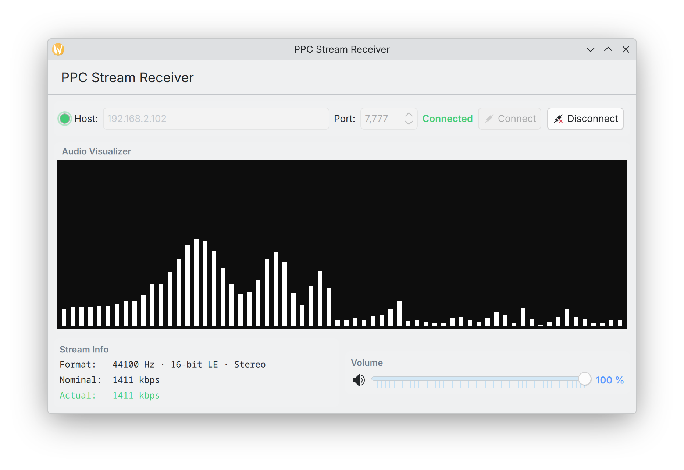

# PPC Stream Server

> The code in this repository was "agentically engineered", mostly for fun to see if Claude and OpenCode could solve an interesting task with a legacy computer.
> After some guidance here and there, I would say it's a success, I tasked Claude to use ssh to access the G5 and it was able to remotely compile and test code,
> even going as far as running small AppleScripts over ssh with osascript to do things like adjust the audio levels. Later on, I also tasked it to implement iTunes
> control support, so I could also pipe the system output into the audio mixer and play locally stored music (and also creating an accompanying Qt6 Kirigami Frontend).

> It also didn't really have problems understanding
> the constraints of developing on OS X Leopard and using the old gcc and Xcode toolchain (even considering subtle details like the big-endian nature of the ppc64 G5, or using PowerPC
> specific assembly instructions like using lwsync as a memory barrier across threads).

> Thinking about it, this could make for an interesting LLM benchmark. Either way, now I can listen to my vinyls over the network from a Power Mac G5 using code written
> by a frontier LLM. This has got to be a pretty unique setup :)





> The rest of this README was written by Claude.

A lossless, low-latency audio streaming system that captures line-level audio input from a Power Mac G5 (or any PPC Mac running Mac OS X Leopard) and streams it over the network to one or more clients simultaneously — with iTunes remote control and Linux desktop integration.

Built for a specific use case: a Power Mac G5 receiving audio from a vinyl turntable/CD player setup via its Line In, streamed live to Linux desktops on the local network, with the ability to control iTunes playback from the Linux client via MPRIS2 media keys and desktop widgets.

> **Note:** iTunes audio is not captured directly by the stream server. The audio stream server captures from Line In only. To stream iTunes playback, the Mac's system output must be externally looped back into Line In (e.g. via a cable from headphone out to line in, or an external mixer). The iTunes control features (now playing, transport controls, playlist) operate independently over HTTP and do not affect the audio path.

## Architecture

```
[Audio Source] --> [Mac Line In] --> AudioDeviceIOProc --> ring_buf --> client 1 (stream_receiver.py)
                                    (512 frames/11.6ms)            --> client 2 (stream_receive.sh)
                                                                   --> ... up to 32 clients
                                                                         |
[iTunes] <-- AppleScript <-- itunes_server.py (HTTP :7778) <------------ |
                                   ^                                     |
                                   |--- GET /status (1s poll) -----------|
                                   |--- POST /play, /pause, etc. -------|
                                                                         |
                                                               MPRIS2 D-Bus <--> KDE/GNOME media keys
```

The audio stream server runs persistently on the Mac, always capturing from Line In. Clients connect and disconnect freely without affecting the server or each other. The iTunes control server runs alongside it, exposing iTunes state and controls over HTTP with plist-encoded responses.

On the Linux side, the Qt6/Kirigami client polls the iTunes server for now-playing metadata and registers an MPRIS2 D-Bus service, so standard desktop media keys (play/pause, next, previous) and taskbar widgets control iTunes on the Mac transparently.

## Audio Specs

| Property        | Value                            |
|-----------------|----------------------------------|
| Format          | PCM 16-bit signed, little-endian |
| Sample rate     | 44,100 Hz                        |
| Channels        | 2 (stereo)                       |
| Bitrate         | 1,411 kbps                       |
| Compression     | None (lossless)                  |
| HAL buffer      | 512 frames (~11.6 ms)            |
| Ring buffer     | ~1.5 seconds (262,144 bytes)     |
| Transport       | Raw TCP                          |

## Files

| File                    | Description                                                |
|-------------------------|------------------------------------------------------------|
| `audio_stream_server.c` | Main server — captures Line In and streams to TCP clients  |
| `audio_capture.c`       | Standalone capture tool (writes PCM to stdout)             |
| `itunes_server.py`      | HTTP server exposing iTunes control via AppleScript (Python 2.5) |
| `stream_receiver.py`    | Qt6/Kirigami GUI client with visualiser, MPRIS2, and iTunes control |
| `qml/Main.qml`          | QML frontend with Now Playing card and transport controls  |
| `build.sh`              | Compiles all C sources into `./bin/` on the Mac            |
| `start_server.sh`       | Launches both servers, cleans up on exit                   |
| `tools/audio_info.c`    | Diagnostic tool — shows input device, source, and volume   |
| `tools/set_input.c`     | Utility to switch between Line In and S/PDIF Digital In    |
| `tools/stream_receive.sh` | Minimal CLI client script — connects and plays audio     |
| `tools/stream_send.sh`  | Legacy sender script (replaced by audio_stream_server)     |

## Deploying on a PPC Mac

### Requirements

- Mac OS X 10.5 Leopard (tested on 10.5.8)
- PowerPC G4 or G5 processor
- Xcode / GCC (the system `gcc` from Xcode 3.x works)
- Built-in audio or any CoreAudio-compatible input device
- Python 2.5 (ships with Leopard) — needed for the iTunes control server

### Building

Copy the repository to the Mac (or clone it) and run the build script:

```bash
./build.sh
```

This compiles all four C sources and places the binaries in `./bin/`. The build script handles the correct framework linkage for each binary automatically.

If you prefer to compile manually:

```bash
gcc -O2 -o bin/audio_stream_server audio_stream_server.c \
    -framework CoreAudio -framework CoreFoundation -lpthread

gcc -O2 -o bin/audio_capture audio_capture.c \
    -framework CoreAudio -framework AudioToolbox -framework CoreFoundation

gcc -O2 -o bin/set_input tools/set_input.c \
    -framework CoreAudio

gcc -O2 -o bin/audio_info tools/audio_info.c \
    -framework CoreAudio -framework AudioToolbox -framework CoreFoundation
```

### Configuring the audio input

Check current input device settings:

```bash
./bin/audio_info
```

The Power Mac G5 has two inputs on the built-in audio: analog **Line In** and **S/PDIF Digital In**. Switch between them with:

```bash
./bin/set_input line    # Analog Line In (3.5mm jack)
./bin/set_input spdf    # S/PDIF Digital In (optical)
```

Set the input volume (0-100) with:

```bash
osascript -e 'set volume input volume 75'
```

A value of 75 works well for typical line-level sources. If the audio sounds distorted, lower it. If it's too quiet, raise it.

### Running the servers

The easiest way to start everything is with the startup script:

```bash
./start_server.sh
```

This launches both the audio stream server (port 7777) and the iTunes control server (port 7778), and cleanly shuts down both on Ctrl+C. You can override the ports:

```bash
./start_server.sh 7777 7778
```

To run them individually:

```bash
# Audio stream server only
./bin/audio_stream_server [port]

# iTunes control server only
python itunes_server.py [port]
```

On startup the audio server will print:

```
=== G5 Audio Stream Server ===
Listening on port 7777
Device: ID=258 "Built-in Audio"
Format: 44100 Hz, 16-bit, 2 ch, PCM signed LE
Bitrate: 1411 kbps (lossless)
HAL buffer: 512 frames (11.61 ms)
Ring buffer: 262144 bytes (~1.5 sec)
Max clients: 32
Waiting for connections...

Capturing from Line In...
```

To run in the background persistently:

```bash
nohup ./start_server.sh 2>> ~/g5_server.log &
```

To start it automatically at login, add it to System Preferences > Accounts > Login Items, or create a launchd plist at `~/Library/LaunchAgents/com.g5.audiostream.plist`.

### iTunes Control API

The iTunes control server (`itunes_server.py`) exposes the following HTTP endpoints. All responses are Apple plist XML.

| Method | Endpoint          | Description                              |
|--------|-------------------|------------------------------------------|
| GET    | `/status`         | Current track info, player state, position |
| GET    | `/playlist`       | All tracks in the current playlist       |
| POST   | `/play`           | Resume playback                          |
| POST   | `/play?id=<dbid>` | Play a specific track by database ID     |
| POST   | `/pause`          | Pause playback                           |
| POST   | `/playpause`      | Toggle play/pause                        |
| POST   | `/next`           | Skip to next track                       |
| POST   | `/prev`           | Go to previous track                     |
| POST   | `/stop`           | Stop playback                            |
| POST   | `/volume?v=0-100` | Set iTunes volume                        |
| POST   | `/seek?pos=<sec>` | Seek to position in seconds              |

## Connecting from a Linux client

### GUI client (PPC Stream Receiver)
The recommended way to connect is the Qt6/Kirigami GUI client. It provides:

- Real-time spectrum visualisation (Monstercat-style frequency bars)
- Volume control via `QAudioSink`
- Bitrate monitoring
- **Now Playing card** — shows current iTunes track title, artist, album, playback state, and a progress bar with timestamps
- **Transport controls** — play/pause, stop, next, previous buttons that control iTunes on the Mac
- **MPRIS2 integration** — registers as `org.mpris.MediaPlayer2.G5Stream` on D-Bus, so KDE/GNOME media keys and taskbar widgets work out of the box

#### Requirements

- Python 3
- PyQt6
- NumPy
- dbus-python (for MPRIS2 support)
- Kirigami (KF6) and `qqc2-desktop-style` for native Breeze controls

On Arch/Manjaro:

```bash
sudo pacman -S python-pyqt6 python-numpy python-dbus kirigami qqc2-desktop-style
```

#### Usage

```bash
python3 ./stream_receiver.py
```

Enter the host and port, then click **Connect**. The spectrum visualiser shows a Monstercat-style frequency bar display, and the volume slider controls `QAudioSink` output directly.

When iTunes is playing on the Mac, the Now Playing card appears automatically with track info and transport controls. Media keys on your keyboard (play/pause, next, previous) will control iTunes through the MPRIS2 D-Bus interface.

### CLI client (stream_receive.sh)

For a minimal headless connection, the shell script is still available in the `tools/` directory:

#### Requirements

- `ncat` (from nmap) or `nc`
- `pacat` (PulseAudio / PipeWire-pulse) — recommended player
- `ffplay` (from ffmpeg) — alternative

#### Usage

```bash
./tools/stream_receive.sh [host] [port]
```

Defaults to `192.168.2.102` on port `7777`. Override as needed:

```bash
./tools/stream_receive.sh 192.168.1.50 7777
```

The script auto-detects available players and picks the best one. `pacat` is preferred because it decouples network I/O from the audio callback via an internal ring buffer. `pw-cat` is intentionally avoided as last resort only: it performs a blocking `read()` from stdin inside the PipeWire process callback, which causes regular short stutters when the pipe doesn't have a full quantum of data ready.

### Manual connection

```bash
# pacat (recommended — lowest latency, no blocking reads)
ncat 192.168.2.102 7777 --recv-only | \
    pacat --playback --format=s16le --rate=44100 --channels=2 \
          --latency-msec=200 --process-time-msec=20

# ffplay
ncat 192.168.2.102 7777 --recv-only | \
    ffplay -nodisp -stats \
           -f s16le -sample_rate 44100 -ch_layout stereo \
           -i pipe:0

# Record to a WAV file
ncat 192.168.2.102 7777 --recv-only | \
    ffmpeg -f s16le -ar 44100 -ch_layout stereo -i pipe:0 output.wav
```

## Design Notes

- **IOProc instead of AudioQueue:** `AudioQueueNewInput` on this hardware batches its buffers and delivers them ~4-5 at a time every ~92 ms rather than one at a time every 20 ms. This causes audible gaps regardless of client-side buffering. Registering an `AudioDeviceIOProc` directly on the HAL device fires at the true hardware rate (512 frames / 11.6 ms) with no batching.
- **Non-deprecated APIs throughout:** `AudioDeviceCreateIOProcID` / `AudioDeviceDestroyIOProcID` (introduced in 10.5) replace the old `AudioDeviceAddIOProc` / `AudioDeviceRemoveIOProc`. All property queries use `AudioObjectGetPropertyData` rather than the older `AudioDeviceGetProperty` / `AudioHardwareGetProperty`.
- **PPC endianness:** The HAL delivers 32-bit big-endian IEEE float, which is native on PPC — no byte swap needed on read. The converted 16-bit LE output is written to the ring buffer with a `lwsync` memory barrier before publishing the new write position.
- **Non-blocking capture:** The IOProc writes into the ring buffer and wakes client writer threads via `pthread_cond_broadcast`. It never touches the network, so a slow or disconnected client cannot stall or crash the capture.
- **Slow client handling:** If a client falls more than one ring buffer behind, it is skipped ahead to near the live position rather than receiving stale audio or stalling other clients.
- **`SIGPIPE` ignored:** A disconnecting client never crashes the server.
- **TCP tuning:** Each client socket gets `TCP_NODELAY` to prevent Nagle buffering and a 2-second kernel send buffer (`SO_SNDBUF`) to absorb short network stalls.
- **iTunes control via AppleScript:** The `itunes_server.py` runs as a Python 2.5 HTTP server (compatible with Leopard's built-in Python) and shells out to `osascript` to query and control iTunes. Responses use Apple plist XML, which is natively readable by both Python 2.5's `plistlib` and Python 3's `plistlib` — no JSON dependency on either side.
- **MPRIS2 D-Bus service:** The Linux client registers a single `dbus.service.Object` implementing both `org.mpris.MediaPlayer2` and `org.mpris.MediaPlayer2.Player` interfaces. Status updates are polled from the Mac on a daemon thread and marshaled to the Qt main thread via a queued signal to avoid Qt signal threading issues.
