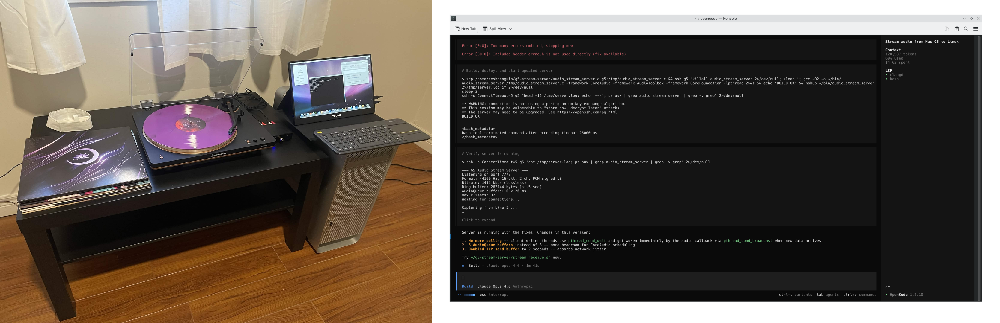

# PPC Stream Server

> The code in this repository was "agentically engineered", mostly for fun to see if Claude and OpenCode could solve an interesting task with a legacy computer.
> After some guidance here and there, I would say it's a success, I tasked Claude to use ssh to access the G5 and it was able to remotely compile and test code,
> even going as far as running small AppleScripts over ssh with osascript to do things like adjust the audio levels.

> It also didn't really have problems understanding
> the constraints of developing on OS X Leopard and using the old gcc and Xcode toolchain (even considering subtle details like the big-endian nature of the ppc64 G5).

> Thinking about it, this could make for an interesting LLM benchmark. Either way, now I can listen to my vinyls over the network from a Power Mac G5 using code written
> by a frontier LLM. This has got to be a pretty unique setup :)



> The rest of this README was written by Claude.

A lossless, low-latency audio streaming system that captures line-level audio input from a Power Mac G5 (or any PPC Mac running Mac OS X Leopard) and streams it over the network to one or more clients simultaneously.

Built for a specific use case: a Power Mac G5 receiving audio from a vinyl turntable/CD player setup via its Line In, streamed live to Linux desktops on the local network.

## Architecture

```
[Audio Source] --> [Mac Line In] --> AudioDeviceIOProc --> ring_buf --> client 1 (stream_receive.sh)
                                    (512 frames/11.6ms)            --> client 2
                                                                   --> ... up to 32 clients
```

The server runs persistently on the Mac, always capturing from Line In. Clients connect and disconnect freely without affecting the server or each other.

A single `AudioDeviceIOProc` registered directly on the HAL device fires at the true hardware interrupt rate (512 frames / ~11.6 ms). This is key: the higher-level `AudioQueue` API batches buffers and delivers them in bursts every ~92 ms on this hardware, causing audible gaps. The IOProc bypasses that entirely. Each callback converts the HAL's native 32-bit big-endian float samples to 16-bit signed little-endian, writes them into a lock-free ring buffer, and wakes the per-client writer threads via a condition variable. The IOProc never touches the network.

## Audio Specs

| Property        | Value                            |
|-----------------|----------------------------------|
| Format          | PCM 16-bit signed, little-endian |
| Sample rate     | 44,100 Hz                        |
| Channels        | 2 (stereo)                       |
| Bitrate         | 1,411 kbps                       |
| Compression     | None (lossless)                  |
| HAL buffer      | 512 frames (~11.6 ms)            |
| Ring buffer     | ~1.5 seconds (262,144 bytes)     |
| Transport       | Raw TCP                          |

## Files

| File                    | Description                                             |
|-------------------------|---------------------------------------------------------|
| `audio_stream_server.c` | Main server — captures Line In and streams to TCP clients |
| `audio_capture.c`       | Standalone capture tool (writes PCM to stdout)          |
| `audio_info.c`          | Diagnostic tool — shows input device, source, and volume |
| `set_input.c`           | Utility to switch between Line In and S/PDIF Digital In |
| `stream_receive.sh`     | Linux client script — connects and plays audio          |
| `stream_send.sh`        | Legacy sender script (replaced by audio_stream_server)  |

## Deploying on a PPC Mac

### Requirements

- Mac OS X 10.5 Leopard (tested on 10.5.8)
- PowerPC G4 or G5 processor
- Xcode / GCC (the system `gcc` from Xcode 3.x works)
- Built-in audio or any CoreAudio-compatible input device

### Building

Copy the source files to the Mac and compile:

```bash
gcc -O2 -o audio_stream_server audio_stream_server.c \
    -framework CoreAudio -framework CoreFoundation -lpthread

gcc -O2 -o audio_info audio_info.c \
    -framework CoreAudio -framework AudioToolbox

gcc -O2 -o set_input set_input.c \
    -framework CoreAudio

gcc -O2 -o audio_capture audio_capture.c \
    -framework CoreAudio -framework AudioToolbox -framework CoreFoundation
```

A good place to put the binaries is `~/bin/`:

```bash
mkdir -p ~/bin
mv audio_stream_server audio_info set_input audio_capture ~/bin/
```

### Configuring the audio input

Check current input device settings:

```bash
~/bin/audio_info
```

The Power Mac G5 has two inputs on the built-in audio: analog **Line In** and **S/PDIF Digital In**. Switch between them with:

```bash
~/bin/set_input line    # Analog Line In (3.5mm jack)
~/bin/set_input spdf    # S/PDIF Digital In (optical)
```

Set the input volume (0-100) with:

```bash
osascript -e 'set volume input volume 75'
```

A value of 75 works well for typical line-level sources. If the audio sounds distorted, lower it. If it's too quiet, raise it.

### Running the server

Start the server:

```bash
~/bin/audio_stream_server
```

It will print status to stderr and begin listening on port 7777. On startup you should see:

```
=== G5 Audio Stream Server ===
Listening on port 7777
Device: ID=258 "Built-in Audio"
Format: 44100 Hz, 16-bit, 2 ch, PCM signed LE
Bitrate: 1411 kbps (lossless)
HAL buffer: 512 frames (11.61 ms)
Ring buffer: 262144 bytes (~1.5 sec)
Max clients: 32
Waiting for connections...

Capturing from Line In...
```

You can optionally pass a different port as the first argument.

To run it in the background persistently:

```bash
nohup ~/bin/audio_stream_server 2>> ~/audio_server.log &
```

To start it automatically at login, add it to System Preferences > Accounts > Login Items, or create a launchd plist at `~/Library/LaunchAgents/com.g5.audiostream.plist`:

```xml
<?xml version="1.0" encoding="UTF-8"?>
<!DOCTYPE plist PUBLIC "-//Apple//DTD PLIST 1.0//EN"
  "http://www.apple.com/DTDs/PropertyList-1.0.dtd">
<plist version="1.0">
<dict>
    <key>Label</key>
    <string>com.g5.audiostream</string>
    <key>ProgramArguments</key>
    <array>
        <string>/Users/swadmin/bin/audio_stream_server</string>
    </array>
    <key>RunAtLoad</key>
    <true/>
    <key>KeepAlive</key>
    <true/>
    <key>StandardErrorPath</key>
    <string>/Users/swadmin/audio_server.log</string>
</dict>
</plist>
```

Load it with:

```bash
launchctl load ~/Library/LaunchAgents/com.g5.audiostream.plist
```

## Connecting from a Linux client

### Requirements

- `ncat` (from nmap) or `nc`
- `pacat` (PulseAudio / PipeWire-pulse) — recommended player
- `ffplay` (from ffmpeg) — alternative

### Usage

```bash
./stream_receive.sh [host] [port]
```

Defaults to `192.168.2.102` on port `7777`. Override as needed:

```bash
./stream_receive.sh 192.168.1.50 7777
```

The script auto-detects available players and picks the best one. `pacat` is preferred because it decouples network I/O from the audio callback via an internal ring buffer. `pw-cat` is intentionally avoided as last resort only: it performs a blocking `read()` from stdin inside the PipeWire process callback, which causes regular short stutters when the pipe doesn't have a full quantum of data ready.

### Manual connection

```bash
# pacat (recommended — lowest latency, no blocking reads)
ncat 192.168.2.102 7777 --recv-only | \
    pacat --playback --format=s16le --rate=44100 --channels=2 \
          --latency-msec=200 --process-time-msec=20

# ffplay
ncat 192.168.2.102 7777 --recv-only | \
    ffplay -nodisp -stats \
           -f s16le -sample_rate 44100 -ch_layout stereo \
           -i pipe:0

# Record to a WAV file
ncat 192.168.2.102 7777 --recv-only | \
    ffmpeg -f s16le -ar 44100 -ch_layout stereo -i pipe:0 output.wav
```

## Design Notes

- **IOProc instead of AudioQueue:** `AudioQueueNewInput` on this hardware batches its buffers and delivers them ~4-5 at a time every ~92 ms rather than one at a time every 20 ms. This causes audible gaps regardless of client-side buffering. Registering an `AudioDeviceIOProc` directly on the HAL device fires at the true hardware rate (512 frames / 11.6 ms) with no batching.
- **Non-deprecated APIs throughout:** `AudioDeviceCreateIOProcID` / `AudioDeviceDestroyIOProcID` (introduced in 10.5) replace the old `AudioDeviceAddIOProc` / `AudioDeviceRemoveIOProc`. All property queries use `AudioObjectGetPropertyData` rather than the older `AudioDeviceGetProperty` / `AudioHardwareGetProperty`.
- **PPC endianness:** The HAL delivers 32-bit big-endian IEEE float, which is native on PPC — no byte swap needed on read. The converted 16-bit LE output is written to the ring buffer with a `lwsync` memory barrier before publishing the new write position.
- **Non-blocking capture:** The IOProc writes into the ring buffer and wakes client writer threads via `pthread_cond_broadcast`. It never touches the network, so a slow or disconnected client cannot stall or crash the capture.
- **Slow client handling:** If a client falls more than one ring buffer behind, it is skipped ahead to near the live position rather than receiving stale audio or stalling other clients.
- **`SIGPIPE` ignored:** A disconnecting client never crashes the server.
- **TCP tuning:** Each client socket gets `TCP_NODELAY` to prevent Nagle buffering and a 2-second kernel send buffer (`SO_SNDBUF`) to absorb short network stalls.
